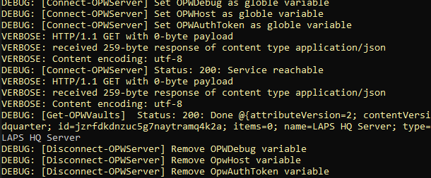

# Installation 1Password Connect Server in Azure Web-APP
I write this manual while I could not finde the solution how install 1Password conection server in Azure. The [1Password developer documentation](https://developer.1password.com/docs/connect) explains how to install a server on another platforms. Among other things with Docker technology. This technology can be used in Azure Web-App. 

## Solution Overview
In this installtion guide, I explain how to install 1Password Connect Server in an Azure Web-App and how to test it with a Powershell script.

## Prerequisite

- 1Password Account with subscription
- one or more vaults
- Screts automation workflow from 1Password
    - 1password-credentials.json file 
- Azure subscription
- Linux and Powershell skills 
- My OnePassword [Powershell SDK ](https://github.com/StevieKnight/PSOnePassword-SDK) or another SDK for testing the 1Password API

## Create Secrets Automation workflow
1. Sign in to 1 Password Account and go to "Developer Tools" in the right side menu.
2. Under "Other-> Connect" you can create a "Connect Server" authenfizierungs file. You need following infos:
    * Enviroment Name
    * one or more Vaults 
    * name for the token 
3. 1password-creadentials.json and the access token should be saved in other vaults.
4. Downlaod the 1password-creadentials.json file for later use.

## Create Azure WEB-APP 

1. Sign in to Azure Portal and search for **App Services**
2. Create new **Web App**
    * Use existing **Resource Group** or create new one 
    * Finding a unique name for a new Web-APP
    * Publish select **Docker Container** 
    * Operating System select **Linux**
    * A Region of your choice
    * A Pricing Plan, I use Plan B1 [*](https://azure.microsoft.com/pricing/details/app-service/windows/)
    * Under Docker tab, select to **Docker compose(Preview)**  in options
    * A Image Source change to **Docker Hub**
    * Use the docker-compose.yaml file from this repository for **Configuration File** option
    * Default values can be used on all tabs
    * Create the App now
3. Change setting **WEBSITES_ENABLE_APP_SERVICE_STORAGE** under *Settings -> Configuration -> Application settings* from FALSE on TRUE.
4. Restart the Web-APP 
5. Open your browser and open url https://**\<YOUR-WEB-APP-NAME>**.scm.azurewebsites.net/newui/kududebug
6. Run the command mkdir op && vi op/1password-creadentials.json in the bash shell and press *I* key for -- insert -- mode.
7. Copy the content from orginal 1password-creadentials.json file in the new one over the clipboard. I use the Windows context menu to copy and paste.
8. Press ctrl + c and shift+ : and write wq + press ENTER for save and close the file.
9. Close this tab und restart the Web-APP
> Important: Check the security option for Web-APP in Azure. Not all of the internet needs to access it. 

Now the 1 Password Connection Server is read for testing.

## Testing the API 
If you use my SDK for to test 1Password COnnection Server, the next step.Unless you have another option to test the api.

1. Install PSOnePassword as described [here](https://github.com/StevieKnight/PSOnePassword-SDK#importing)
2. Open the 1password.api-test.ps1 and change placeholder through your token and hostname.
3. Open Powershell and start the script.
4. If you now see such a similar output, enverything has worked. Here the vault "LAPS HQ Server" was found. I have released this in 1Password.

      

**Congratulations it works :-)** Have fun for developent with 1 Password API.
If you have any idea how to write a biecp file for deployment with composer dockerfile. Let me know!

